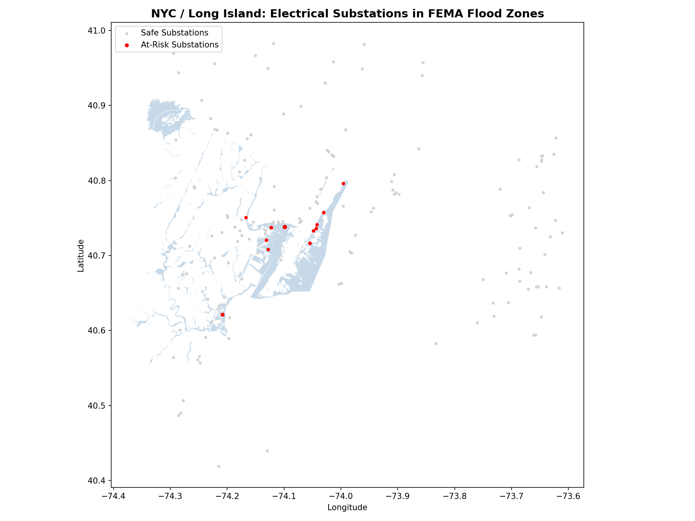

# Geospatial-Data-Science
Raghad J. Data Science Portfolio **Currenlty ongoing projects!** 

**Latest Project June 2026**
NE Resilience Grid

# ⚡ Northeast Grid Inundation Risk Analysis

> Identifying critical electrical infrastructure vulnerable to coastal flooding using Python, GeoPandas, and live FEMA flood zone data.

---

## 📌 Project Summary

Identified **12 critical electrical substations** across the NYC/New Jersey region at high risk of inundation during a 100-year flood event, using GeoPandas spatial joins against live FEMA flood zone data. Substations were scored by flood zone severity and transmission line count to prioritize engineering attention.

**Key Finding:** 3.12% of the NYC/Long Island regional grid's transmission capacity — representing 12 out of 384 total lines — is directly exposed to FEMA-designated Special Flood Hazard Areas, putting it at risk of failure during a single major storm surge event.

---

## 🗺️ Map Output



*Red dots = at-risk substations inside FEMA flood zones. Grey dots = safe substations. Blue polygons = FEMA Special Flood Hazard Areas (Zone AE).*

---

## 🔍 Top At-Risk Substations

| Name | City | State | Lines | Flood Zone | Risk Score |
|------|------|-------|-------|------------|------------|
| KEARNY | Kearny | NJ | 7 | AE | 4.90 |
| UNKNOWN132612 | Linden | NJ | 3 | AE | 3.70 |
| UNKNOWN140971 | Jersey City | NJ | 1 | AE | 3.10 |
| ESSEX | Newark | NJ | 1 | AE | 3.10 |
| CLAY STREET | Newark | NJ | 0 | AE | 2.80 |
| UNKNOWN132361 | Hoboken | NJ | 0 | AE | 2.80 |

*Full results in `at_risk_substations.csv`*

---

## 🧠 Methodology

### Data Sources
- **Infrastructure:** FEMA Homeland Security Infrastructure Program (HSIP) — Electrical Transmission Substations dataset (8,712 substations across 14 Northeast states)
- **Hazard:** FEMA National Flood Hazard Layer (NFHL) — fetched live via ArcGIS REST API, filtered to Special Flood Hazard Zones: A, AE, AO, AH, VE, V

### Step by Step Process
1. **Filter** — Isolated only active (`IN SERVICE`), true substations from 8,712 total assets
2. **Clip** — Focused study area on NYC/Long Island bounding box
3. **Spatial Join** — Used GeoPandas `sjoin` with `predicate='within'` to identify substations inside flood polygons
4. **Risk Scoring** — Custom composite score weighted 70% flood zone severity + 30% transmission line count

### Risk Score Formula
```
RISK_SCORE = (ZONE_SCORE × 0.7) + (LINE_SCORE × 0.3)
```

Risk Score Range: 0 (no risk) → 5.0 (maximum risk)

Breakdown:
- A substation in Zone VE with 10+ lines = highest possible score (~5.0)
- A substation in Zone AE with 0 lines  = lowest at-risk score (2.8)
- Anything below 2.8 = outside flood zones = not flagged

| Risk Score | Risk Level | Meaning |
|------------|------------|---------|
| 4.5 – 5.0  | 🔴 Critical | High-voltage, coastal flood zone |
| 3.5 – 4.4  | 🟠 High     | Multiple lines in flood zone |
| 2.8 – 3.4  | 🟡 Moderate | Active substation in flood zone |
| 0 – 2.7    | 🟢 Safe     | Outside flood zones |

| Flood Zone | Severity Score | Description |
|------------|---------------|-------------|
| VE / V | 5 | Coastal high-velocity wave action |
| AE | 4 | High-risk, detailed flood study |
| A / AO | 3 | High-risk, approximate boundary |
| AH | 2 | Shallow flooding risk |

---

## 📊 Grid Impact Summary

```
Total transmission lines in NYC/LI region:       384
Transmission lines exposed to flood zones:         12
Percentage of regional grid capacity at risk:   3.12%
```

---

## 🛠️ Tech Stack

| Tool | Purpose |
|------|---------|
| Python 3 | Core language |
| GeoPandas | Spatial data loading and joins |
| Shapely | Geometry operations |
| Pandas | Data manipulation and export |
| Matplotlib | Map visualization |
| Requests | Live FEMA API data fetching |

---

## 🚀 How to Run

**1. Clone the repo**
```bash
git clone https://github.com/YOUR_USERNAME/grid-resilience-analysis.git
cd grid-resilience-analysis
```

**2. Install dependencies**
```bash
pip install geopandas pandas matplotlib shapely requests
```

**3. Run the analysis**
```bash
python analysis.py
```

**Outputs:**
- `at_risk_substations.csv` — ranked table of vulnerable substations
- `risk_map.png` — spatial map of results

## 📁 Project Structure

```
grid-resilience-analysis/
├── analysis.py                                        # Main Python script
├── Electrical_Transmission_Substations_(HSIP).geojson # Source data
├── at_risk_substations.csv                            # Output: results table
├── risk_map.png                                       # Output: map
└── README.md
```

---

## 💡 Real-World Context

The substations flagged by this analysis are focused in the Newark/Jersey City/Hoboken corridor which is the exact area that suffered severe grid failures during **Hurricane Sandy (2012)**, which caused over $65 billion in damage and left millions without power. This analysis provides a repeatable, data framework for prioritizing flood hardening investments across the Northeast grid.

---

## 🔭 Future Work

- Expand bounding box to cover full Northeast coastline (MA, MD, VA)
- Integrate NOAA SLOSH storm surge model for hurricane-specific scenarios
- Add interactive HTML map using Folium for web-based stakeholder reporting
- Cross-reference with population density data to quantify people-at-risk per substation


---

## 🦆 About Me
When I'm not writing Python scripts or querying databases, I am an avid bird watcher. I find that the patience and observation skills required for birding translate perfectly to the meticulous work of data cleaning and pattern recognition. 

- 📫 **LinkedIn:** https://www.linkedin.com/in/raghad-jazairy/
